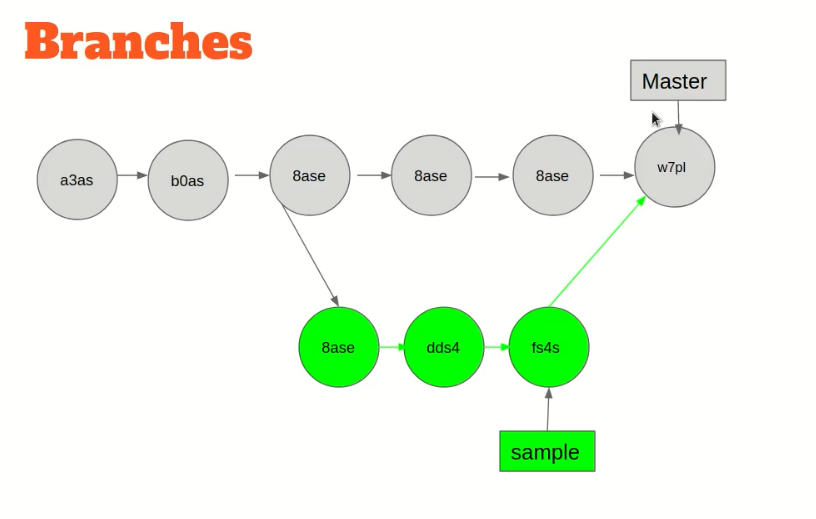
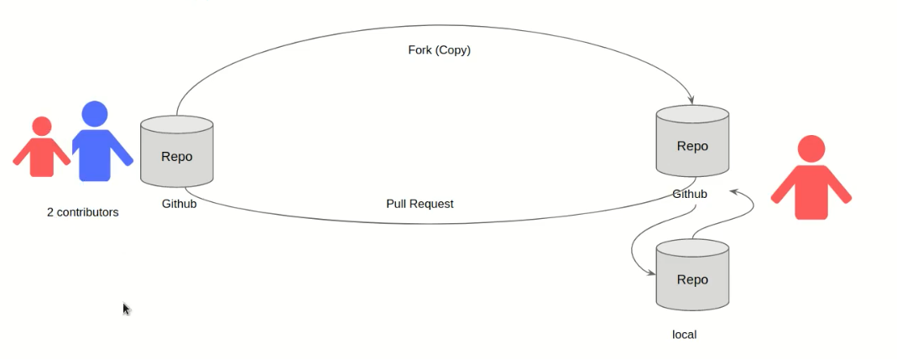

- [Course Author Website](http://abolkog.com)


```bash
# showing all commits
git log

# showing all commits, using abbriviated (commit hash code)
git log --abbrev-comit

# comitting (or taking a snapshot) with a message
git commit -m "yourMessage"

# comitting without a message (opening the editor)
git commit

# a kind of listing files inside a directory
ls -altr
```

- [A Visual Git Reference Link](http://marklodato.github.io/visual-git-guide/index-en.html)

----


- SSH Kyes => you can use it to not be exhaust inputting your (username, password) for each (clone, push, etc...) processes, (processes related working with the remote repo. like github)
- (public key) can be shared with other people, and it is be copied to your github account. But (private key) it must not share with anyone.
- [more about SSH keys](https://docs.github.com/en/authentication/connecting-to-github-with-ssh/generating-a-new-ssh-key-and-adding-it-to-the-ssh-agent)


```bash
# hosting your project files on github using (SSH keys)
git remote add origin git@github.com:UserName/RepoName.git

# to see all of your remote Repositories links
git remote -v
```

- [Study Markdown Language here]( https://guides.github.com/features/mastering-markdown/)
- (.gitignore file) => any (filename) or (forlderName) you put inside it, Git will not track Updates over them.

---




```bash
# to show all branches you have in your Repo.
git branch

# to create a new branch in your Repo. from the current commit
git branch <branchName>

# to create a new branch in your Repo. from a specific commit
git branch <branchName> <commitHashCode>

# to traverse over your branches
git checkout <branchNameYouWantToMoveTo>
git switch <branchNameYouWantToMoveTo>

# Note: if you made (git log) command inside a new branch you create, you will find (all commits) you made before in the (other branches) #

# to (upload to staging area & comitting) at once
git commit -am "yourMessage"

# to merge your updates in (secodaryBrach) to (mainBranch)
git merge <secondaryBranch>

# Note: you must be inside the (branch) you want to make merge for it #

# to create a new branch in your Repo, and move to it at once
git checkout -b <branchName>

# to delete a branch inside (your local Repo.)
git branch -d <branchName>

# to push a branch to (Remote Repo.)
git push origin <branchName>

# to delete a branch inside (Remote Repo.)
git push --delete <branchName>
```

---


```BASH
# to know what changes happened on (working directory) stage
git diff <filename>
git diff

# to discard changes you did on (working directory) stage
git checkout -- <fileName>
git checkout -- .

# to discard changes you moved them to (staging index) stage
git restore --staged <fileName>
git restore --staged .

# Abbriviated presentation for (commits hash codes)
git log --pretty=one

# to discard changes you moved them to (local Repo.) stage
# (just traversing on commits hash codes)
git revert <hashCodeOfCommitYouWantToMoveToIt>

# Resets the (working directory), (staging area), and (commit history) to the specified commit.
# All changes after the reset point are deleted, both in tracked and untracked files.
git reset --hard <SpecifiedCommitHashCode>

# Resets only (the commit history) to the specified commit.
# Changes in the (working directory) and (staging area) are preserved, allowing you to re-stage them if needed.
git reset --soft <SpecifiedCommitHashCode>
```

- [1st Merging Tool(DiffMerge)](https://sourcegear.com/diffmerge/)
- [2nd Merging Tool(Meld)](http://meldmerge.org/)

```bash
# Use (a locally installed) or (a default merge) tool
git mergetool

# to show the differences between (remote) & (local) Repos.
git diff origin/master

# to use a tool to show (the differences)
git difftool origin/master

# to select which (diff) or (merge) tool you want to open
git difftool -t  <toolNameYouWillUseForThisPurpose>
git mergetool -t  <toolNameYouWillUseForThisPurpose>

# to set up a (diff) or (merge) tool for Git
git config --global diff.tool <toolName>
git config --global merge.tool <toolName>

# to set up ensuring of opening (diff) or (merge) tool fast
git config --global difftool.prompt false
git config --global mergetool.prompt false

# to give to Git the path of (diff) or (merge) tool
git config --global difftool.path ".exe path of tool"
git config --global mergetool.path ".exe path of tool"
```

----


- Tags => It makes a marker for a commit in (the commits history), developers used in to make releases for their products.

```bash
# to make (a light weight tag) to the current commit
git tag <tagName>

# to make (an annotated tag) to the current commit
git tag -a <tagName> -m "messageOfTag"

# to make (a light weight tag) to a specific commit
git tag <tag-name> <commit-hash>
git tag -a <tag-name> <commit-hash> -m "Tag message"

# to show list of tags you have inside your project
git tag
git tag -l
git tag -l "*portionOfString"

# to push a tag to (the remote Repo.)
git push origin <tagName>

# to push a number of tags to (the remote Repo.) at once
git push origin --tags

# to show details about a specific tag you created before
git show <tagName>

# to delete a specific tag you created before
git tag -d <tagName>
git tag --delete <tagName>

# Note: You can not to traverse over (tags) like commits, but if you wanted to traverse and work on (an old tag), you should 1) make a branch from this tag. 2) make checkout or move to this branch you created from this tag. #

# make a branch from a tag, then move to it, or make together
git branch <branchName> <tagName>
git checkout <branchName>
git checkout -b <branchName> <tagName>
```

---





